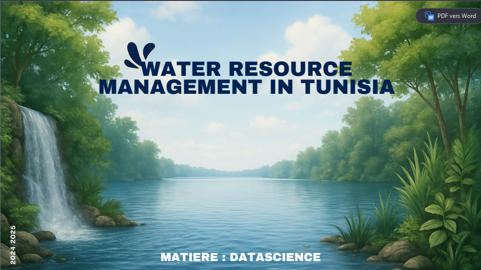

<p align="center">
  
</p>

<h1 align="center">💧 Projet Data/IA – Analyse des Ressources Hydrauliques en Tunisie</h1>

<p align="center">
  <b>Projet universitaire • Data Science • Analyse de données • Visualisation</b>
</p>

<p align="center">
  
  
  
  
  
</p>

---

## 🟥 Présentation du projet
Ce projet a été réalisé dans le cadre d’un projet universitaire en Data Science.  
Il porte sur l’analyse et l’étude de la gestion des ressources hydriques en Tunisie,
à travers l’exploitation de données et le développement d’une application Python.

L’objectif est de mieux comprendre la situation hydrique et de proposer
une visualisation claire et exploitable des informations.

---

## 🟥 Objectifs du projet
-  Analyser des données liées aux ressources en eau  
-  Identifier des tendances et indicateurs importants  
-  Mettre en pratique les notions de Data Science  
-  Développer une application d’analyse simple  
-  Présenter les résultats sous forme de rapport et de présentation  

---

## 🟥 Contenu du repository
- `app.py` : application principale du projet  
- `projet_water.ipynb` : notebook d’analyse et d’exploration des données  
- `water_data.csv` : jeu de données utilisé  
- `presentation.pdf` : support de présentation du projet  
- `rapport_ressources_hydriques.docx` : rapport détaillé  
- `projet.png` : image de couverture  

---

## 🟥 Fonctionnalités principales
-  Chargement et traitement des données  
-  Analyse statistique de base  
-  Visualisation des résultats  
-  Interprétation d’indicateurs hydriques  
-  Exécution via script Python et notebook  

---

## 🟥 Technologies et outils utilisés
-  Python  
-  Jupyter Notebook  
-  Pandas  
-  Matplotlib  
-  Microsoft Word & PowerPoint  
-  Outils de visualisation de données  

---

## 🟥 Exécution du projet

### Lancer l’application
```bash
python app.py

